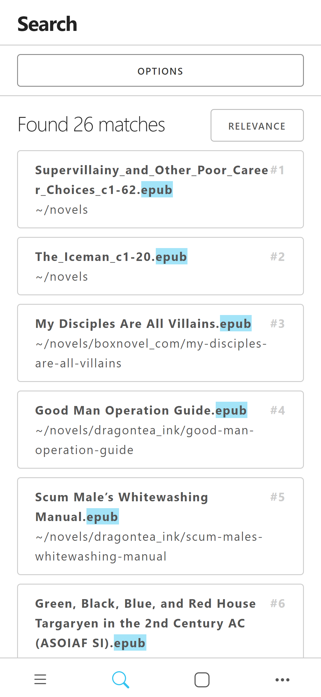
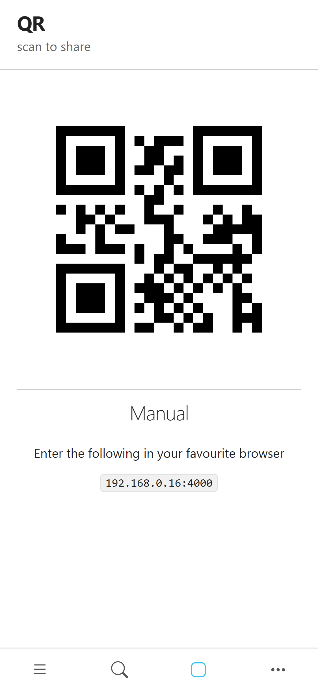

# QR share

[](https://badge.fury.io/py/qrshare)

<p float="left" align="middle">
  
  
  
</p>

Serve a file on local network and give the url in qrcode form on console

For extra security provide a password `--password [password]`

## Install

```bash
pip install qrshare
```

## Usage

### Send to

> Windows only

Creating a shortcut in `shell:sendto` provides for easier use of convenience

#### commandline

```bash
qrshare config --sendto
```

#### manually

Press `Windows` + `r` and enter `shell:sendto`

> %USERPROFILE%\AppData\Roaming\Microsoft\Windows\SendTo

Create shortcut with command `qrshare serve` in folder

now option qrshare should appear when you right click to a file

### Commandline

> `qrshare --help`

```bash
Usage: __main__.py [OPTIONS] COMMAND [ARGS]...

Options:
  --help  Show this message and exit.

Commands:
  config  change user configurations
  serve   serve given list paths as per given options
```

> `qrshare config --help`

```bash
Options:
  --sendto  reset windows 'Send To' shortcut
  --help    Show this message and exit.
```

> `qrshare serve --help`

```bash
Options:
  -p, --password TEXT  when provided every device require authentication
  --port INTEGER       waitress server port
  --help               Show this message and exit.
```

### Code Example

```python
from qrshare import App

app = App(paths)
app.serve(True)
```
